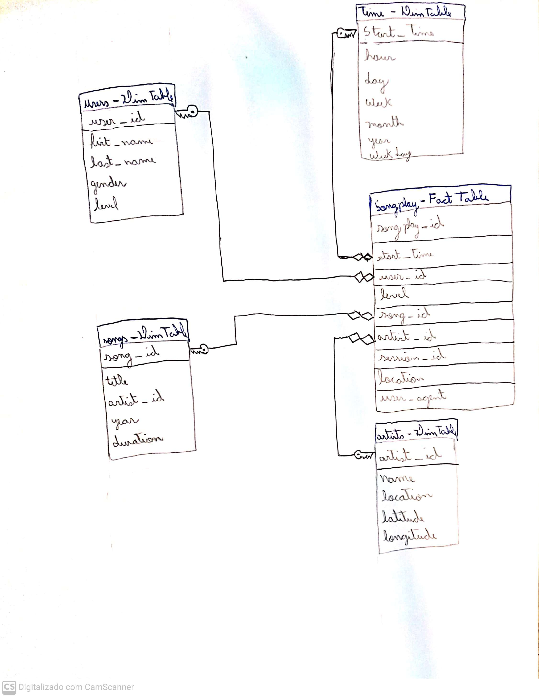

# Udacity Dataengineer Degree - Project 1A

## Data Modeling with Postgres

---

### Project Context:

- A startup called Sparkify wants to analyze the data they've been collecting on songs and user activity on their new music streaming app. The analytics team is particularly interested in understanding what songs users are listening to. Currently, they don't have an easy way to query their data, which resides in a directory of **JSON logs on user activity** on the app, as well as a directory with **JSON metadata on the songs** in their app.
- They'd like a data engineer to create a Postgres database with tables designed to optimize queries on song play analysis, and bring you on the project. Your role is to create a database schema and **ETL pipeline** for this analysis. You'll be able to test your database and ETL pipeline by running queries given to you by the analytics team from Sparkify and compare your results with their expected results.

### Solution Description:

- In order to best fit the needs of the startup, 5 new tables were build with PostgresSQL with a [**Star Schema**](https://en.wikipedia.org/wiki/Star_schema), as follows the image:  
  
- The **songplay** is the [**Fact Table**](https://en.wikipedia.org/wiki/Fact_table#:~:text=In%20data%20warehousing%2C%20a%20fact,schema%20surrounded%20by%20dimension%20tables.) of the Star Schema, which will be used to quickly retrieve information about users activity on the app, while the [**Dimension Tables**](<https://en.wikipedia.org/wiki/Dimension_(data_warehouse)>) **users, time, songs and artists** can be used to retreive the detailed information of entities present in the **songplay** table.

### Project Structure:

- To reproduce the solution present in this repository, you will first have to install some dependencies:
  1. Firstly, you will need to have **PostgresSQL** installed in your machine, refer the [official documentation](https://www.postgresql.org/) in order to properly install it on your OS.
  2. Secondly, you will need to have a **Python 3.6+** installed on your machine, refer the [official documentation](https://www.python.org/) in order to properly install it on your OS.
  3. Third (Tested on Ubuntu 18.04 and 20.04), run the **Makefile** from the project run by typing on the terminal `$ make`. This command will run through the Makefile, in order to build a virtual environment with python and some dependencies to run this project.
  4. Once you sucessfully ran the make command, a folder named `venv` should be installed on the root of the project, aswell as the [`jupyte-notebook`](https://jupyter.org/) installed.
  5. To reproduce the whole ETL solution, first you will have to activate your created virtual environment by typing on your terminal `$ source venv/bin/activate`. Then, type on your terminal `$ python etl.py`. This python script will create a database named `sparkifydb`, then it will create all the 5 tables describe on the Star Schema Image above, and lastly will perform an ETL process, loading all files from `data` directoy, processing them, and populating all five tables previously described.
